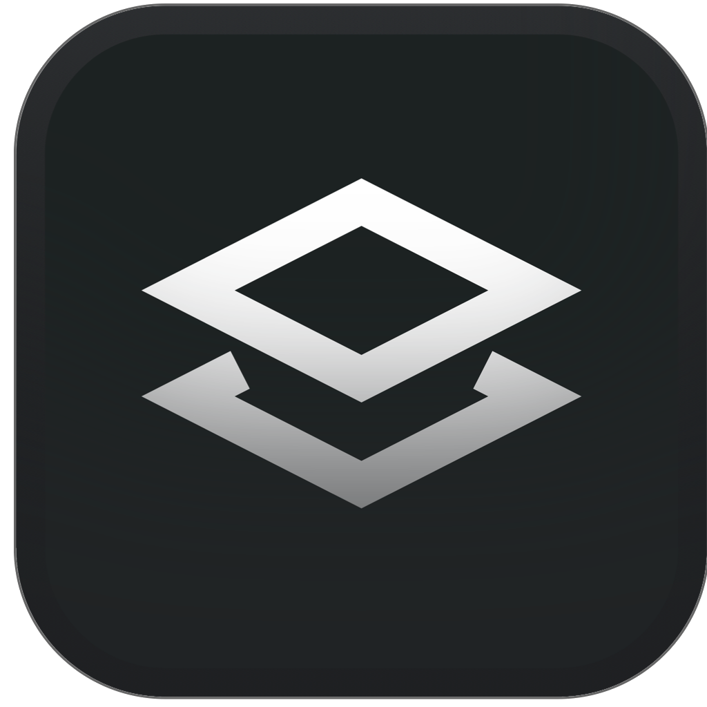
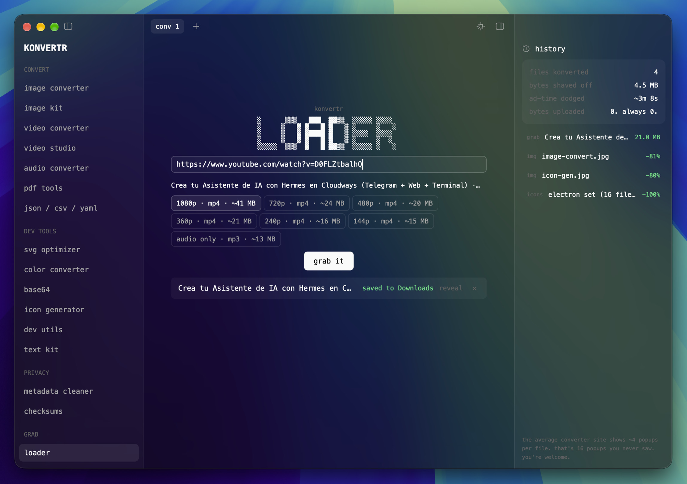
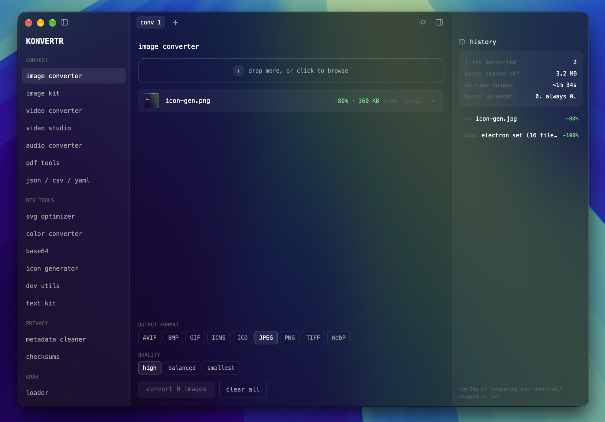
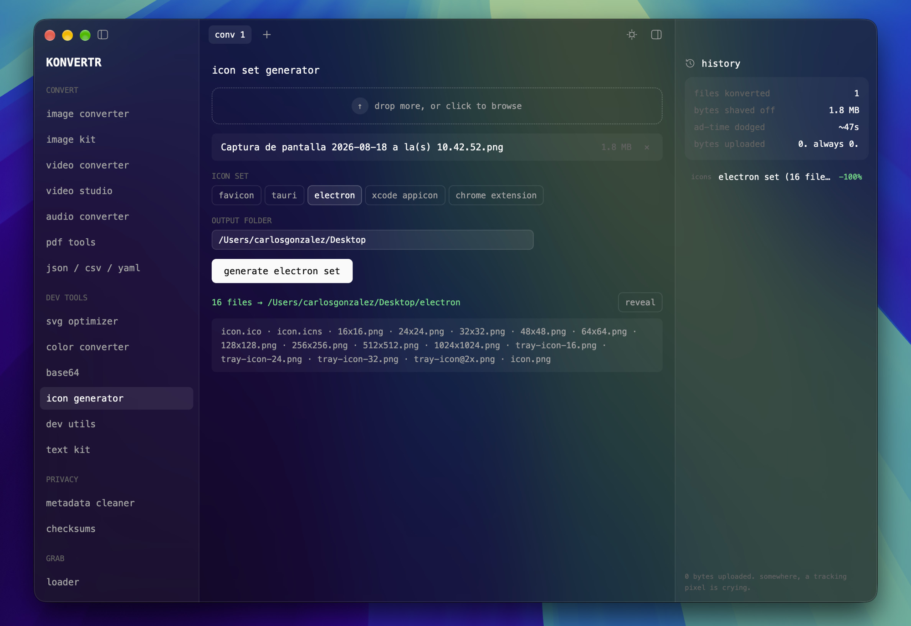

<div align="center">



# Konvertr for Mac

**Every converter tool you keep googling, native and 100% local.**
No uploads, no ads, no accounts. Your files never leave your device.

Rust + [gpui](https://gpui.rs) · the desktop sibling of [konvertr.com](https://konvertr.com)

</div>



<details>
<summary>More screenshots</summary>




</details>

## Tools

**Convert** — images (AVIF, BMP, GIF, ICNS, ICO, JPEG, PNG, TIFF, WebP; HEIC and
AVIF read natively), image kit (social-size presets, ASCII art, colour palettes),
video (10 output formats), video studio (compress to a target size, lossless
trim, GIF studio, frame grabs), audio (MP3, WAV, FLAC, OGG, M4A, Opus), PDF
(merge, split, extract, rotate, images → PDF), and JSON / CSV / YAML / TOML in
any direction.

**Dev tools** — SVG optimiser, colour converter (HEX / RGB / HSL / OKLCH),
Base64, icon generator (favicon, Tauri, Electron, Xcode `AppIcon.appiconset`,
Chrome extension), dev utils (epoch, URL, UUID, JWT), and a text kit (case
conversions, slugify, diff, line tools, Markdown → HTML, regex tester).

**Privacy** — metadata cleaner (strips Exif / XMP / GPS losslessly, no
re-encode) and checksums (MD5 / SHA-1 / SHA-256 with live verification).

**Grab** — *loader*, a yt-dlp downloader for YouTube, X, TikTok, Instagram and
1800+ other sites, with per-resolution size estimates.

## Install

Grab the latest `.dmg` from [Releases](../../releases) and drag Konvertr to
Applications. macOS 12+, Apple Silicon.

## Development

```sh
cargo run -p konvrt          # run the app
cargo test --workspace       # tests
scripts/fetch-ffmpeg.sh      # bundle ffmpeg into dist/bin
scripts/fetch-ytdlp.sh       # bundle yt-dlp into dist/bin
scripts/package-macos.sh     # build Konvertr.app
```

The workspace splits into `crates/core` (pure conversion logic, no UI deps,
unit-tested), `crates/ui` (the whole gpui app), and `apps/konvrt` (a thin
binary). ffmpeg and yt-dlp ship inside the bundle, so nothing needs Homebrew.

### Releases and auto-update

Tag `vX.Y.Z` matching the workspace version and push it — the release workflow
builds, signs with Developer ID, notarises, staples, and drafts a release with
the `.dmg`, the update tarball, and a `manifest.json`. Publishing that draft is
what makes the URLs live.

The app checks `releases/latest/download/manifest.json` on launch and shows an
update pill in the titlebar: one click downloads the tarball, verifies its
checksum and signature, swaps the bundle, and offers a restart. Builds run from
`cargo run` never self-update — only an installed `.app` does. Once you have a
Developer ID, set `EXPECTED_TEAM_ID` in `crates/core/src/update.rs` so an update
signed by anyone else is refused. It needs these repository secrets:

| Secret | What it is |
| --- | --- |
| `MACOS_CERT_P12` | base64 of the Developer ID Application `.p12` |
| `MACOS_CERT_PASSWORD` | that certificate's password |
| `MACOS_SIGN_IDENTITY` | e.g. `Developer ID Application: Name (TEAMID)` |
| `APPLE_ID` | Apple ID used for notarisation |
| `APPLE_TEAM_ID` | the team id |
| `APPLE_APP_PASSWORD` | an app-specific password |

Without them the workflow still builds an ad-hoc signed app.

## Credits

Icons from [Solar Icons](https://www.figma.com/community/file/1166831539721848736)
by 480 Design (CC BY 4.0). Bundles [ffmpeg](https://ffmpeg.org) and
[yt-dlp](https://github.com/yt-dlp/yt-dlp). Built by
[9th Avenue](https://the9thave.com).
